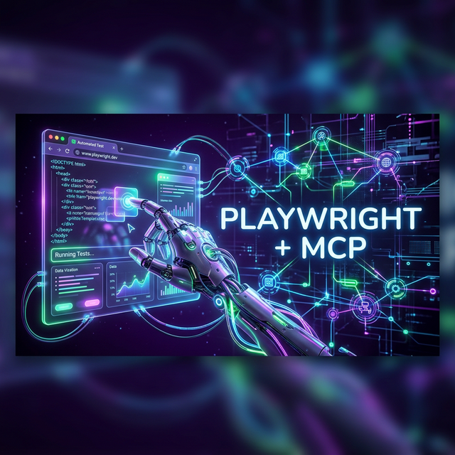
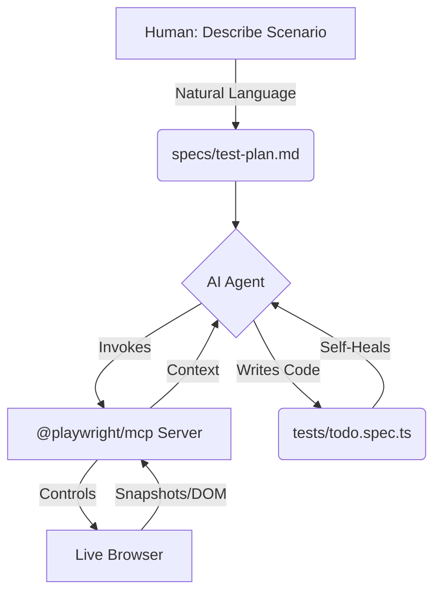

# 🎭 Playwright + MCP: AI-Driven Browser Automation 🤖



<div align="center">
  <p><strong>Give AI agents eyes and hands to write, run, and heal your UI tests in real-time.</strong></p>
  <p>
    
    
    
    <a href="https://github.com/jay-yeluru/playwright-mcp/actions/workflows/ci.yml">
      
    </a>
  </p>
</div>

---

## ✨ What This Is

Ever wish your AI assistant could actually **see** your app, **click** buttons, and **fix** its own mistakes?

By leveraging **`@playwright/mcp`**, we give AI agents a live browser to interact with. Instead of guessing what your HTML looks like, the AI navigates a real browser instance, reads the actual DOM, and generates resilient, production-ready Playwright tests.

### 🚀 Key Capabilities

- 👁️ **Visual Intelligence** — the AI sees your app exactly as a user does
- ⚡ **Auto-Healing** — tests break? the AI detects the change and fixes locators instantly
- ✍️ **Zero-Code Test Writing** — describe a scenario in plain English; the AI writes the `.spec.ts`
- 🕵️ **DOM Mastery** — real-time DOM analysis to find the most resilient selectors

---

## 🗺️ How It Works

The AI reads your test plan, uses your Page Objects, and controls a live browser via the `@playwright/mcp` server.



---

## 🕹️ Quick Start

### Step 0: Set up your environment

```bash
# Install dependencies
npm install

# Copy the env template and (optionally) update BASE_URL
cp .env.example .env

# Install browsers
npx playwright install chromium
```

### Step 1: Connect `@playwright/mcp` to your AI

Your AI needs to know the MCP tools are available.

- **VS Code:** MCP-compatible extensions (Copilot / Cline) auto-read `.vscode/mcp.json`
- **Claude Desktop:** Add the following to your `claude_desktop_config.json`, replacing `/absolute/path/to/` with your actual path:

```json
{
  "mcpServers": {
    "playwright": {
      "command": "npx",
      "args": ["@playwright/mcp"],
      "env": {
        "PATH": "..."
      },
      "cwd": "/absolute/path/to/playwright-mcp"
    }
  }
}
```

### Step 2: Generate tests with AI

Open your AI chat window. Two modes available:

**Option A — Freestyle (fully autonomous)**
*The AI writes the whole suite from scratch based on what it sees in the live browser.*

> *"Use your Playwright MCP tools to open the app at `https://demo.playwright.dev/todomvc`, inspect the live DOM, and write a full test suite from scratch in `tests/seed.spec.ts`. Use the `todoPage` POM methods and the `TODO_ITEMS` data constants. Group tests in describe blocks by feature."*

**Option B — Fill the Gaps (compare & contrast)**
*The AI explores the app to find missing coverage, writes tests, then compares against the reference file.*

> *"Run the tests. `seed.spec.ts` only checks that the app loads. Use MCP to explore the live TodoMVC app and add tests to `seed.spec.ts` for features not yet covered. Check `todo.spec.ts` afterwards to compare your output to the reference implementation."*

### Step 3: Run the suite

```bash
npm run test
```

### Step 4: Auto-heal broken tests

Locators break. Let the AI fix them.

1. **Break it:** Open `pages/TodoPage.ts` and change `.new-todo` to `.broken-input`
2. **Watch it fail:** Run `npm run test` — observe the crash 🔥
3. **Heal it:** Prompt your AI:

> *"My tests are failing. Use your Playwright MCP tools to open the live app, inspect the DOM, find the correct locator, and fix `TodoPage.ts`."*

---

## 📂 Project Structure

```text
playwright-mcp/
├── .github/
│   └── workflows/
│       └── ci.yml            🔄 GitHub Actions CI pipeline
├── data/
│   └── todo.data.ts      📦 Typed test data (no hardcoded strings in specs)
├── fixtures/
│   └── base.ts           🔌 Custom fixtures (auto-injects TodoPage)
├── pages/
│   └── TodoPage.ts       🧱 Page Object Model + assertion helpers
├── specs/
│   └── test-plan.md      📄 Plain-English test plan (AI entry point)
├── tests/
│   ├── seed.spec.ts      🌱 Blank canvas — AI writes tests here
│   └── todo.spec.ts      ✅ Reference implementation
├── .env.example              🌍 Environment template
├── playwright.config.ts      ⚙️  Env-aware Playwright configuration
└── package.json              📦 Scripts & dependencies
```

### Separation of Concerns

| Layer | File(s) | Responsibility |
|---|---|---|
| **Config** | `playwright.config.ts`, `.env` | Where to run, how to report |
| **Data** | `data/todo.data.ts` | What to test (typed strings) |
| **Pages** | `pages/TodoPage.ts` | How to interact (locators + actions) |
| **Fixtures** | `fixtures/base.ts` | Setup / teardown wiring |
| **Demo** | `tests/seed.spec.ts` | 🌱 Blank canvas — give this to the AI |
| **Reference** | `tests/todo.spec.ts` | ✅ Finished implementation to compare against |

---

## 🛠️ Prerequisites

| Requirement | Version |
|---|---|
| Node.js | v18 or higher |
| @playwright/mcp | installed via `npm install` |
| Chromium | `npx playwright install chromium` |

---

<div align="center">
  <h3>Ready to let AI write and heal your tests?</h3>
  <p>Star this repo and let the browser do the talking. ⭐</p>
</div>