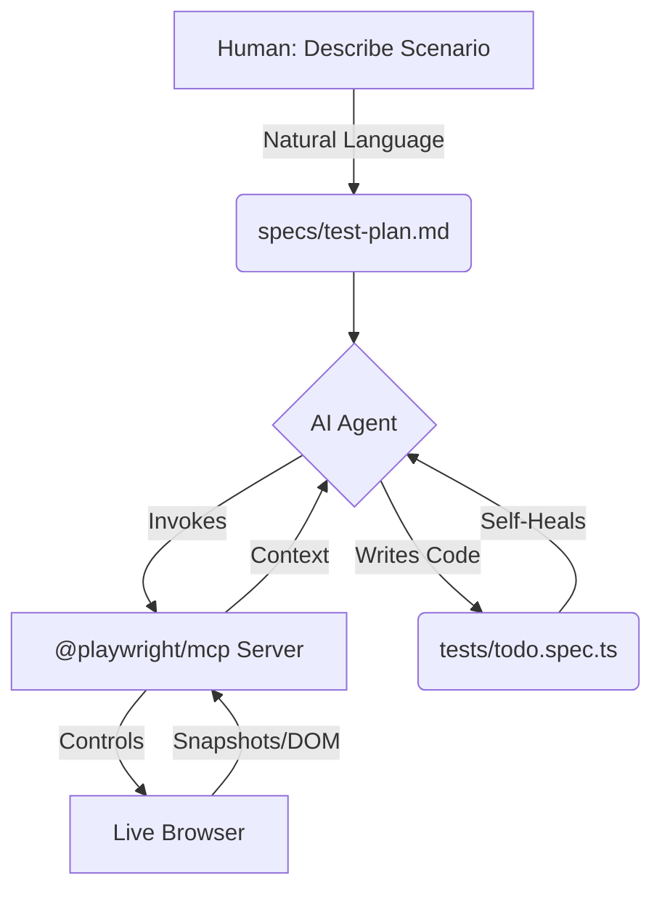

# 🎭 Playwright + MCP: AI-Driven Browser Automation 🤖


<div align="center">
  <p><strong>Give AI agents eyes and hands to write, run, and heal your UI tests in real-time.</strong></p>
  <p>
    
    
    
    <a href="https://github.com/jay-yeluru/playwright-mcp/actions/workflows/ci.yml">
      
    </a>
  </p>
</div>

---

## ✨ What This Is

Ever wish your AI assistant could actually **see** your app, **click** buttons, and **fix** its own mistakes?

By leveraging **`@playwright/mcp`**, we give AI agents a live browser to interact with. Instead of guessing what your HTML looks like, the AI navigates a real browser instance, reads the actual DOM, and generates resilient, production-ready Playwright tests.

### 🚀 Key Capabilities

- 👁️ **Visual Intelligence** — the AI sees your app exactly as a user does
- ⚡ **Auto-Healing** — tests break? the AI detects the change and fixes locators instantly
- ✍️ **Zero-Code Test Writing** — describe a scenario in plain English; the AI writes the `.spec.ts`
- 🕵️ **DOM Mastery** — real-time DOM analysis to find the most resilient selectors

---

## 🗺️ How It Works

The AI reads your test plan, uses your Page Objects, and controls a live browser via the `@playwright/mcp` server.



---

## 🕹️ Quick Start

### Step 0: Set up your environment

```bash
# Install dependencies
npm install

# Copy the env template and (optionally) update BASE_URL
cp .env.example .env

# Install browsers
npx playwright install chromium
```

---

### Step 1: Install `@playwright/mcp`

Install it as a dev dependency so it's pinned to your project and doesn't prompt on every run:

```bash
npm install @playwright/mcp --save-dev
```

Verify it's in `package.json`:

```bash
cat package.json | grep playwright
```

You should see:

```json
"devDependencies": {
  "@playwright/mcp": "^0.0.x"
}
```

Also make sure your `package.json` scripts use `@playwright/mcp` and **not** `playwright run-test-mcp-server`:

```json
"scripts": {
  "test": "playwright test",
  "mcp": "npx @playwright/mcp"
}
```

> ⚠️ `playwright run-test-mcp-server` ships with `@playwright/test` and only exposes test-runner tools — it does **not** give the AI live browser control. They are different packages.

---

### Step 2: Connect `@playwright/mcp` to your AI

**VS Code (GitHub Copilot Agent mode)** ⭐ recommended — create `.vscode/mcp.json` in your project root:

```json
{
  "servers": {
    "playwright": {
      "type": "stdio",
      "command": "npx",
      "args": ["@playwright/mcp"]
    }
  }
}
```

> No `cwd` needed — VS Code uses the workspace root automatically. Switch Copilot chat to **Agent** mode to access MCP tools.

**Claude Desktop** — add the following to `claude_desktop_config.json`, replacing `/absolute/path/to/` with your actual path from `pwd`:

```json
{
  "mcpServers": {
    "playwright": {
      "command": "npx",
      "args": ["@playwright/mcp"],
      "env": {
        "PATH": "/usr/local/bin:/usr/bin:/bin"
      },
      "cwd": "/absolute/path/to/playwright-mcp"
    }
  }
}
```

**Antigravity IDE** — open Agent session → **"…"** → MCP Servers → Manage MCP Servers → View raw config, then add the same config as Claude Desktop above. Note: `${workspaceFolder}` is not supported — use an absolute path.

> For full step-by-step setup instructions for each tool, see [docs/SETUP.md](docs/SETUP.md).

---

### Step 3: Verify MCP is connected ✅

Don't skip this — a misconfigured server silently fails and the AI will just say it has no browser tools.

**VS Code (Copilot)**

1. Open Command Palette → `Ctrl+Shift+P` (Mac: `Cmd+Shift+P`)
2. Type **"MCP: List Servers"** — `playwright` should show status `running`
3. Check `View → Output → MCP` for any connection errors

**Claude Desktop**

1. Fully quit and reopen Claude Desktop after saving the config
2. Open a new chat and look for the **🔨 hammer icon** in the input bar
3. Click it — you should see tools like `browser_navigate`, `browser_click`, `browser_snapshot`, `browser_type`
4. If the hammer icon is missing, check the logs:

```bash
# macOS
tail -f ~/Library/Logs/Claude/mcp-server-playwright.log

# Windows (PowerShell)
Get-Content "$env:APPDATA\Claude\logs\mcp-server-playwright.log" -Wait
```

**Quick smoke test (works in any AI tool)**

Send this prompt:

> _"List all available MCP tools"_

If connected, the AI lists `browser_navigate`, `browser_click`, `browser_snapshot`, etc.

---

### Step 4: Generate tests with AI

Open your AI chat window. Two modes available:

**Option A — Freestyle (fully autonomous)**
_The AI writes the whole suite from scratch based on what it sees in the live browser._

> _"Use your Playwright MCP tools to open the app at `https://demo.playwright.dev/todomvc`, inspect the live DOM, and write a full test suite from scratch in `tests/seed.spec.ts`. Use the `todoPage` POM methods and the `TODO_ITEMS` data constants. Group tests in describe blocks by feature."_

**Option B — Fill the Gaps (compare & contrast)**
_The AI explores the app to find missing coverage, writes tests, then compares against the reference file._

> _"Run the tests. `seed.spec.ts` only checks that the app loads. Use MCP to explore the live TodoMVC app and add tests to `seed.spec.ts` for features not yet covered. Check `todo.spec.ts` afterwards to compare your output to the reference implementation."_

---

### Step 5: Run the suite

```bash
npm run test
```

---

### Step 6: Auto-heal broken tests

Locators break. Let the AI fix them.

1. **Break it:** Open `pages/TodoPage.ts` and change `.new-todo` to `.broken-input`
2. **Watch it fail:** Run `npm run test` — observe the crash 🔥
3. **Heal it:** Prompt your AI:

> _"My tests are failing. Use your Playwright MCP tools to open the live app, inspect the DOM, find the correct locator, and fix `TodoPage.ts`."_

---

## 📂 Project Structure

```text
playwright-mcp/
├── .github/
│   └── workflows/
│       └── ci.yml            🔄 GitHub Actions CI pipeline
├── data/
│   └── todo.data.ts          📦 Typed test data (no hardcoded strings in specs)
├── docs/
│   └── SETUP.md              📖 Complete setup guide for all AI tools
├── fixtures/
│   └── base.ts               🔌 Custom fixtures (auto-injects TodoPage)
├── pages/
│   └── TodoPage.ts           🧱 Page Object Model + assertion helpers
├── specs/
│   └── test-plan.md          📄 Plain-English test plan (AI entry point)
├── tests/
│   ├── seed.spec.ts          🌱 Blank canvas — AI writes tests here
│   └── todo.spec.ts          ✅ Reference implementation
├── .env.example              🌍 Environment template
├── playwright.config.ts      ⚙️  Env-aware Playwright configuration
└── package.json              📦 Scripts & dependencies
```

### Separation of Concerns

| Layer         | File(s)                        | Responsibility                                |
| ------------- | ------------------------------ | --------------------------------------------- |
| **Config**    | `playwright.config.ts`, `.env` | Where to run, how to report                   |
| **Data**      | `data/todo.data.ts`            | What to test (typed strings)                  |
| **Pages**     | `pages/TodoPage.ts`            | How to interact (locators + actions)          |
| **Fixtures**  | `fixtures/base.ts`             | Setup / teardown wiring                       |
| **Demo**      | `tests/seed.spec.ts`           | 🌱 Blank canvas — give this to the AI         |
| **Reference** | `tests/todo.spec.ts`           | ✅ Finished implementation to compare against |

---

## 🛠️ Prerequisites

| Requirement       | Version                                  |
| ----------------- | ---------------------------------------- |
| Node.js           | v18 or higher                            |
| `@playwright/mcp` | `npm install @playwright/mcp --save-dev` |
| Chromium          | `npx playwright install chromium`        |

---

## 📖 Documentation

- [Complete Setup Guide](docs/SETUP.md) — step-by-step for VS Code, Claude Desktop, and Antigravity IDE, with troubleshooting

---

## ❓ Having Issues?

See the [Troubleshooting section in SETUP.md](docs/SETUP.md#8-troubleshooting) for detailed diagnosis of the most common problems.

| Symptom                                          | Quick fix                                                                  |
| ------------------------------------------------ | -------------------------------------------------------------------------- |
| 🔨 Hammer icon missing in Claude Desktop         | Fully quit and reopen; validate `claude_desktop_config.json` is valid JSON |
| AI says it has no browser tools                  | Check MCP logs or VS Code `Output → MCP`                                   |
| `npx @playwright/mcp` prompts to install         | Run `npm install @playwright/mcp --save-dev`                               |
| MCP script uses `playwright run-test-mcp-server` | Update `package.json` scripts to use `npx @playwright/mcp`                 |
| Tools listed but browser won't open              | Run `npx playwright install chromium`                                      |
| `playwright` missing from MCP: List Servers      | Switch Copilot to **Agent** mode; check `.vscode/mcp.json` exists          |

---

Ready to let AI write and heal your tests? Star this repo and let the browser do the talking. ⭐
