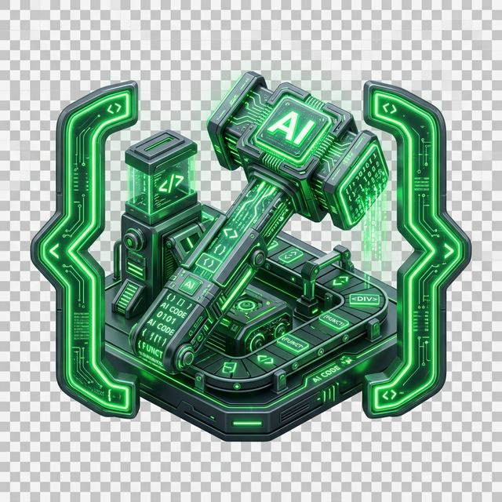
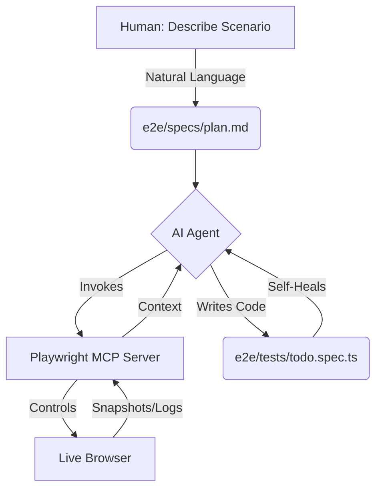

# 🎭 Playwright + MCP: The Future of AI-Driven Testing 🤖


<div align="center">
  <p><strong>Supercharging AI Agents to Write &amp; Heal Your UI Tests in Real-Time!</strong></p>
  <p>
    
    
    
    <a href="https://github.com/jay-yeluru/playwright-mcp/actions/workflows/ci.yml">
      
    </a>
  </p>
</div>

---

## ✨ The Magic of Playwright + MCP

Ever wish your AI assistant could actually **see** your app, **click** buttons, and **fix** its own mistakes? 

By leveraging the **Model Context Protocol (MCP)**, we've given our AI agents "hands" and "eyes." Instead of just guessing what your HTML looks like, the AI now interacts with a live browser instance through the Playwright MCP Server.

### 🚀 Key Superpowers
- 👁️ **Visual Intelligence:** The AI sees your app exactly as a user does.
- ⚡ **Auto-Healing:** Tests break? The AI detects the change and fixes the code instantly.
- ✍️ **Zero-Code Testing:** Describe a scenario in plain English; the AI writes the `.spec.ts` for you.
- 🕵️ **DOM Mastery:** Real-time analysis of the actual DOM to find the most resilient locators.

---

## 🦸‍♂️ Meet the Agent Squad

We've recruited three specialized AI agents (found in `.github/agents/`) to handle every stage of your testing lifecycle.

| The Planner | The Generator | The Healer |
| :---: | :---: | :---: |
|  |  |  |
| **Architect of Journeys** | **The Master Builder** | **The Test Doctor** |
| Scans your URL and drafts the perfect test strategy. | Turns plain-English plans into production-ready code. | Diagnoses failures and repairs broken locators automatically. |

---

## 🗺️ How It Works (The Blueprint)

This repository follows a rock-solid, AI-friendly architecture. The AI reads your **Test Plans**, uses your **Page Objects**, and controls a browser via the **MCP Server**.



---

## 🕹️ Let's Play! (Quick Start)

### Step 0: Set up your environment 🌍

```bash
# Install dependencies
npm install

# Copy the env template and (optionally) change BASE_URL
cp .env.example .env

# Install browsers
npx playwright install chromium
```

### Step 1: Fire up your AI 🔌
Your AI needs to know the MCP tools exist.
- **VS Code:** MCP-compatible extensions (Copilot / Cline) auto-read `.vscode/mcp.json`.
- **Claude Desktop:** Add the same settings to your `claude_desktop_config.json`.

### Step 2: Summon the Generator 🪄
Open your AI chat window and type:

> *"Use your Playwright MCP tools to open the app, inspect the live DOM, and add meaningful test steps to the 'seed' test in `e2e/tests/seed.spec.ts`. Use the `todoPage` POM methods and the `TODO_ITEMS` data constants. Group new tests in describe blocks by feature."*

> 💡 **Tip:** Check `e2e/tests/todo.spec.ts` to see the reference implementation — that's the "after" state showing what great AI-generated tests look like.

### Step 3: Run the suite ▶️

```bash
npm run test
```

### Step 4: Unleash the Test Healer 🩺
Locators break. Let's make the AI fix one.

1. **Break It:** Open `e2e/pages/TodoPage.ts` and change `.new-todo` to `.broken-input`.
2. **Watch It Fail:** Run `npm run test` and watch the crash. 🔥
3. **Call The Doctor:** Prompt your AI:
> *"My tests are failing. Act as a test healer. Use your Playwright MCP debug tools to investigate the failure, find the correct locator in the live DOM, and fix `TodoPage.ts`."*

---

## 📂 Project Anatomy

```text
playwright-mcp/
├── .github/
│   ├── agents/          🤖 AI Brains (Planner, Generator, Healer)
│   └── workflows/
│       └── ci.yml       🔄 GitHub Actions CI pipeline
├── e2e/
│   ├── data/
│   │   └── todo.data.ts 📦 Typed test data (no hardcoded strings in specs)
│   ├── fixtures/
│   │   └── base.ts      🔌 Custom fixtures (auto-injects TodoPage)
│   ├── pages/
│   │   └── TodoPage.ts  🧱 Page Object Model + assertion helpers
│   ├── specs/
│   │   └── demo-plan.md 📄 Plain-English test plan (AI entry point)
│   └── tests/
│       ├── seed.spec.ts 🌱 Blank canvas — AI writes tests here (demo entry point)
│       └── todo.spec.ts ✅ Reference implementation — the finished "after" state
├── .env.example         🌍 Environment template
├── playwright.config.ts ⚙️  Env-aware Playwright configuration
└── package.json         📦 Scripts & dependencies
```

### Separation of Concerns

| Layer | File(s) | Responsibility |
|---|---|---|
| **Config** | `playwright.config.ts`, `.env` | Where to run, how to report |
| **Data** | `e2e/data/todo.data.ts` | What to test (typed strings) |
| **Pages** | `e2e/pages/TodoPage.ts` | How to interact (locators + actions) |
| **Fixtures** | `e2e/fixtures/base.ts` | Setup / teardown wiring |
| **Demo** | `e2e/tests/seed.spec.ts` | 🌱 Blank canvas — give this to the AI |
| **Reference** | `e2e/tests/todo.spec.ts` | ✅ Finished implementation to compare against |

---

## 🛠️ Prerequisites

| Requirement | Version |
|---|---|
| Node.js | v18 or higher |
| Playwright | installed via `npm install` |
| Chromium | `npx playwright install chromium` |

---

<div align="center">
  <h3>Ready to build the future of testing?</h3>
  <p>Star this repo and let the AI do the heavy lifting! ⭐</p>
</div>